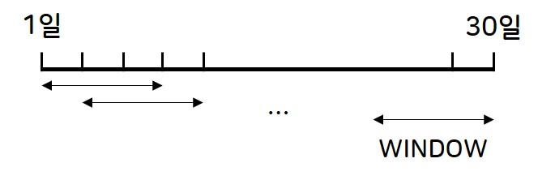

# [DACON] 시스템 품질 변화로 인한 사용자 불편 예지 AI 경진대회
* 제출일: 2020-02-07
* 팀명: asdf
* 팀원: 김명선, 이지훈


## 목차
1. 라이브러리 및 데이터
2. error 데이터를 활용한 피쳐 추출


## 1. 라이브러리 및 개발 환경
* 사용 library 및 version:  

|Library|Version|
|------|------|
|pandas|1.1.4|
|numpy|1.19.2|
|scikit-learn|0.24.0|
|lightgbm|3.1.1|
|catboost|0.24.4|
|tqdm|4.54.0|

* 개발 환경: Windows 10 64비트


## 2. error 데이터를 활용한 피쳐 추출
### 2-1. 데이터 일별 분리
* error 데이터는 **time, fwver, model_nm, errtype, errcode**를 포함하고 있음
* 원본 데이터는 에러가 발생할 때마다 log가 찍혀 있는데 이를 일별로 변경하는 전처리 진행
* 해당 작업은 split_error_data_in_day 함수에서 진행되며 input과 output은 다음과 같음
```python
def split_error_data_in_day(err_df, data_type):
    """
    원본 error_data를 불러와 일별 데이터로 분리

    [Input]
    err_df: train or test error data
    data_type: train or test 지정

    [Output]
    err_df_in_day_user: user id별 일별 error data
    """
    
    # 코드 생략

    return err_df_in_day_user
``` 
* return variable인 err_df_in_day_user는 각 user의 데이터를 저장하고 있는 list
* 각각의 list는 1일~30일까지의 day index를 key로 갖고 해당하는 error dataframe을 value로 갖는 dictionary를 저장하고 있음 
* 예시로 user id 10000의 day 1이 저장하고 있는 데이터는 다음과 같음 
```ipynb
Out[4]: 
   model_nm       fwver  errtype errcode
0   model_3  05.15.2138       26       1
1   model_3  05.15.2138       15       1
2   model_3  05.15.2138       16       1
3   model_3  05.15.2138       15       1
4   model_3  05.15.2138       16       1
5   model_3  05.15.2138        4       0
6   model_3  05.15.2138        4       0
7   model_3  05.15.2138       15       1
8   model_3  05.15.2138       16       1
9   model_3  05.15.2138        4       0
10  model_3  05.15.2138        4       0
11  model_3  05.15.2138       15       1
```

### 2-2. Error type과 code
#### 2-2-1. 새로운 Error code 생성
* Error type: 1~42까지 중 29를 제외한 41개가 존재
* Error code: 각 type별로 다양하게 존재
* Error type을 비슷한 유형끼리 묶게 되면 성능이 크게 감소하는데, 반대로 type을 세분화하는 code를 활용하는 것이 유의미할 것이라 판단함
* Error code는 다음과 같은 이유로 그대로 사용할 수 없음
    1. train에는 없지만 test에 있는 error code가 다수 존재
    2. 예시로, Error type 38번에 경우 error code가 5000개 이상 존재해 개별적으로 사용할 경우 복잡도가 지나치게 커짐
* 따라서 빈도수가 높은 Error code만 남겨 type과 조합하고 그 외에는 UNKNOWN으로 처리하여 학습에 제외
* 해당 작업은 process_errcode 함수에서 진행되며 예시로 error type 1에 대한 처리는 다음과 같음
```python
if e == 1:
    for i, ec in enumerate(errcode):
        if ec == '0':
            new_errcode[np.where(idx)[0][i]] = str(e) + '-' + ec
        elif ec[0] == 'P':
            new_errcode[np.where(idx)[0][i]] = str(e) + '-' + 'P'
        elif ec.isdigit():
            new_errcode[np.where(idx)[0][i]] = str(e) + '-' + 'num'
        else:
            print(f'Unknown error code for error type {e}')
            new_errcode[np.where(idx)[0][i]] = str(e) + '-' + 'UNKNOWN'
```
* train_err_data의 error type 1의 error code 종류와 processing 결과는 다음과 같음
* 0, P로 시작하는 code, 0 이외의 숫자, UNKNOWN의 4가지 유형으로 분류하여 새로운 code 생성함

|error type|error code|processed errror code|
|------|------|------|
|1|0|1-0|
|1|P-41001|1-P|
|1|P-41007|1-P|
|1|P-41010|1-P|
|1|P-41011|1-P|
|1|100|1-num|
|1|others|1-UNKNOWN|

* train_err_data를 generate_new_errcode 함수에 입력하여 새로운 error code 조합을 생성하고 이것을 인코딩
* test_err_data는 학습 데이터의 인코더를 사용하여 변환함

#### 2-2-2. 데이터 transformation
* transform_errtype 함수를 이용해 각 user, day마다의 error dataframe을 array 형태로 변경
* 이 때, error type과 code는 일별 발생 횟수를 집계함
* 예외로 error type 38의 error code는 numeric value라 판단하여 발생 횟수가 아닌 code 숫자의 합계에 대한 피쳐 생성

#### 2-2-3. Feature extraction
* extract_err 함수를 통해 일별 데이터를 아래 그림과 같이 WINDOW마다 summation하여 피쳐를 생성함 




### 2-3. Model_nm과 fwver
