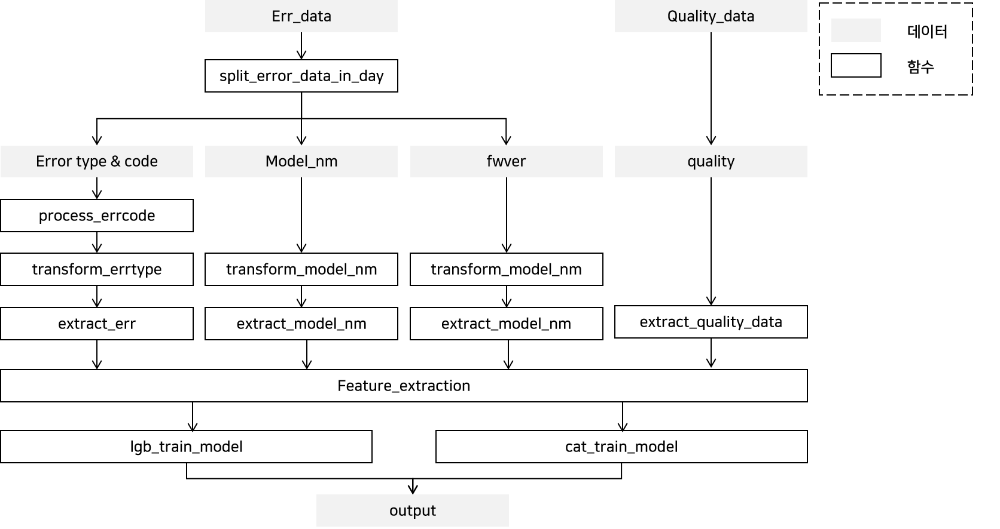

# [DACON] 시스템 품질 변화로 인한 사용자 불편 예지 AI 경진대회
* 제출일: 2020-02-07
* 팀명: asdf

* 사용 library 및 version:  
    > pandas == 1.1.4  
     numpy ==1.19.2  
     scikit-learn == 0.24.0  
     lightgbm == 3.1.1  
     catboost == 0.24.4  
     tqdm == 4.54.0  
     matplotlib == 3.3.3  
     lime == 0.2.0.1

* 개발 환경: Windows 10 64비트

## 목차
1. Overview
2. Error 데이터를 활용한 피쳐 추출  
    2-1. 데이터 일별 분리  
    2-2. Error type과 code  
    2-3. Model_nm  
    2-4. fwver  
3. quality 데이터를 활용한 피쳐 추출  
    3-1. Filter quality  
    3-2. Extract feature from quality  
4. 피쳐 통합  
5. 모델 학습  
6. 결과  

## 1. Overview

* 사용된 데이터와 함수의 관계는 위와 같음
* 본 README.md 에서는 main.py 함수에 대한 설명만을 담았으며 프로젝트에 포함된 파일은 다음과 같음
```setup
.
└── main.py # 메인 파일
└── README.md # main.py의 코드 설명 파일
└── 에러분석.ipynb # Error 데이터 분석 파일
└── quality분석.ipynb # quality 데이터 분석, quality와 에러 데이터 분석, XAI 분석
└── 사용자불만접수원인분석.ipynb # 사용자 불만 제기 원인 분석 파일
└── img/ # README.md에 포함된 이미지를 저장한 디렉토리
```

## 2. Error 데이터를 활용한 피쳐 추출
### 2-1. 데이터 일별 분리 (func split_error_data_in_day)
* error 데이터는 **time, fwver, model_nm, errtype, errcode**를 포함하고 있음
* 원본 데이터는 에러가 발생할 때마다 log가 찍혀 있는데 이를 일별로 분리
* split_error_data_in_day 함수의 return값인 err_df_in_day_user는 각 user의 데이터를 저장하고 있는 list
* 각각의 list는 1일~30일까지의 day index를 key로 갖고 해당하는 error dataframe을 value로 갖는 dictionary를 저장하고 있음 
* 예시로 user id 10000의 day 1이 저장하고 있는 데이터는 다음과 같음
```ipynb
Out[4]: 
   model_nm       fwver  errtype errcode
0   model_3  05.15.2138       26       1
1   model_3  05.15.2138       15       1
2   model_3  05.15.2138       16       1
3   model_3  05.15.2138       15       1
4   model_3  05.15.2138       16       1
5   model_3  05.15.2138        4       0
6   model_3  05.15.2138        4       0
7   model_3  05.15.2138       15       1
8   model_3  05.15.2138       16       1
9   model_3  05.15.2138        4       0
10  model_3  05.15.2138        4       0
11  model_3  05.15.2138       15       1
```

### 2-2. Error type과 code
#### 2-2-0. 새로운 Error code 생성 (func process_errcode)
* Error type: 1~42까지 중 29를 제외한 41개가 존재
* Error code: 각 type별로 다양하게 존재
* Error type을 비슷한 유형끼리 묶게 되면 성능이 크게 감소하는데, 반대로 type을 세분화하는 code를 활용하는 것이 유의미할 것이라 판단함
* Error code는 다음과 같은 이유로 그대로 사용할 수 없음
    1. train에는 없지만 test에 있는 error code가 다수 존재
    2. 예시로, Error type 38번에 경우 error code가 5000개 이상 존재해 개별적으로 사용할 경우 복잡도가 지나치게 커짐
* 따라서 빈도수가 높은 Error code만 남겨 type과 조합하고 그 외에는 UNKNOWN으로 처리하여 학습에 제외
* 해당 작업은 process_errcode 함수에서 진행되며 예시로 error type 1에 대한 처리는 다음과 같음
* 0, P로 시작하는 code, 0 이외의 숫자, UNKNOWN의 4가지 유형으로 분류하여 새로운 code 생성함
```python
if e == 1:
    for i, ec in enumerate(errcode):
        if ec == '0':
            new_errcode[np.where(idx)[0][i]] = str(e) + '-' + ec
        elif ec[0] == 'P':
            new_errcode[np.where(idx)[0][i]] = str(e) + '-' + 'P'
        elif ec.isdigit():
            new_errcode[np.where(idx)[0][i]] = str(e) + '-' + 'num'
        else:
            print(f'Unknown error code for error type {e}')
            new_errcode[np.where(idx)[0][i]] = str(e) + '-' + 'UNKNOWN'
```
* 상기 code snippet으로 처리된 error code processing 결과는 아래 표와 같음

|error type|error code|processed errror code|
|------|------|------|
|1|0|1-0|
|1|P-41001|1-P|
|1|P-41010|1-P|
|1|P-41011|1-P|
|1|any digit|1-num|

* train_err_data를 process_errcode 합수에 입력해 새로운 error code 조합을 생성하고 인코더 생성
* test_err_data는 학습 데이터의 인코더를 사용하여 변환함
* UNKNOWN이 포함된 code는 집계하지 않음

#### 2-2-1. Transform data (func transform_errtype)
* 각 user, day마다의 error dataframe을 error array 형태로 변경
* 이 때, error type과 code는 일별 발생 횟수를 집계함
* 예외로 error type 38의 error code는 numeric value라 판단하여 발생 횟수가 아닌 code 숫자의 합계에 대한 피쳐 생성
* error type (42가지) + error code (98가지) + error 38 관련 피쳐 1가지로, (user id 수) x (30) x (141) 형태의 array 반환

#### 2-2-2. Extract feature from error (func extract_err)
* 에러 type과 code를 통해 피쳐를 생성함
    1. 일별 데이터를 아래 그림과 같이 window마다 summation하여 변환함

        * window 길이는 사용자 불만 label을 통해 최적화하여 3일로 선정
    2. 각 error에 대하여 차원 축소를 위해 5가지의 통계적 특징 추출 (mean, max, min, median, standard deviavion)
* extract_err 함수는 (userid 수) x (error type 수 + error code 수 + 1) 의 형태를 가진 dataframe을 반환함

### 2-3. Model_nm
#### 2-3-1. Transform data (func transform_model_nm)
* 각 user, day마다 error dataframe을 model_nm array 형태로 변경
* 이 때, 요일별로 어떤 model_nm이었는지 저장

#### 2-3-2. Extract feature from model_nm (func extract_model_nm)
* extract_model_nm 함수를 통해 피쳐를 생성하였고 각각에 대한 설명은 다음과 같음

|Feature|Explanation|
|------|------|
|model_exist|0~8 model_nm 사용 유무에 대한 flag|
|model_diff|30일 내에 유저의 model_nm이 변경되었는지에 대한 flag|
|model_upgrade|model_nm 업그레이드 유무에 대한 flag|
|model_downgrade|model_nm 다운그레이드 유무에 대한 flag|
|model_start|유저가 가장 처음에 사용한 model_nm에 대한 범주형 변수|
|model_end|유저가 가장 마지막 사용한 model_nm에 대한 범주형 변수|

* upgrade 및 downgrade는 model 번호가 아닌 fwver을 기준으로 판단하였으며 그에 따른 순서는 아래 표와 같음

|model_nm|fwver|order|
|------|------|------|
|0|04.22.x|3|
|1|04.16.x|2|
|2|04.33.x|4|
|3|05.15.x|7|
|4|03.11.x|1|
|5|04.82.x|6|
|6|10 / 8.5.3|9|
|7|05.66.x|8|
|8|04.73.x|5|

### 2-4. fwver
#### 2-4-1. Transform data (func transform_fwver)
* 각 user, day마다 error dataframe을 fwver array 형태로 변경
* 이 때, 요일별로 어떤 fwver였는지 저장
* fwver이 x. y. z의 형태이므로 이 3가지를 분리하여 저장

#### 2-4-2. Extract feature from fwver (func extract_fwver)
* model_nm과 유사한 방식으로 피쳐 생성
* fwver의 x. y. z 중 x만 사용하였으며 나머지 자리는 유의미한 모델 성능 향상을 보이지 않아 제외함

|Feature|Explanation|
|------|------|
|fwver_diff|30일 내에 유저의 fwver이 변경되었는지에 대한 flag|
|fwver_upgrade|fwver 업그레이드 유무에 대한 flag|
|fwver_downgrade|fwver 다운그레이드 유무에 대한 flag|
|fwver_start|유저가 가장 처음에 사용한 fwver에 대한 범주형 변수|
|fwver_end|유저가 가장 마지막 사용한 fwver에 대한 범주형 변수|

## 3. quality 데이터를 활용한 피쳐 추출 (func extract_quality_data)
### 3-1. Filter quality
* quality 데이터는 0~12까지 13개의 quality와 fwver로 이루어져있음
* 다음 표와 같이 quality 데이터 중 중복되거나 의미없는 정보를 삭제
* 13개중 3개를 제외하고 10개의 quality를 사용

|Quality|Explanation|
|------|------|
|quality_0|quality_2와 중복|
|quality_3|값이 0만 존재|
|quality_4|값이 0만 존재|

### 3-2. Extract feature from quality
* error 데이터와 달리, 별도의 transformation 없이 전체 시점에 대하여 피쳐를 추출
* extract_quality_data 함수를 이용
    1. quality 중 -1의 발생 횟수를 집계
    2. 5가지의 통계적 특징 추출 (mean, max, min, median, standard deviavion)

## 4. 피쳐 통합 (func feature_extraction)
* 상기 2~3에서 생성된 피쳐를 통합하였으며 다음 순서로 진행됨
    1. Extract error type, code
    2. Extract model_nm
    3. Extract fwver
    4. Extract quality 
    5. Concatenate all the dataframes

## 5. 모델 학습 (func lgb_train_model, cat_train_model)
* lgb_train_model 함수를 이용해 lightgbm 모델 학습 및 추론
* cat_train_model 함수를 이용해 catboost 모델 학습 및 추론
* Bayesian optimization을 통해 파라미터를 튜닝하였으며 제출 코드에는 포함하지 않음

## 6. 결과
* 앙상블시, validation 성능을 가장 높이는 weight를 탐색했고 lightgbm과 catboost 각각 0.6, 0.4로 선정
* 10-fold cross validation을 통한 성능 평가 결과는 다음과 같음 

|lightgbm|catboost|ensemble|
|------|------|------|
|84.43%|84.10%|84.43%|